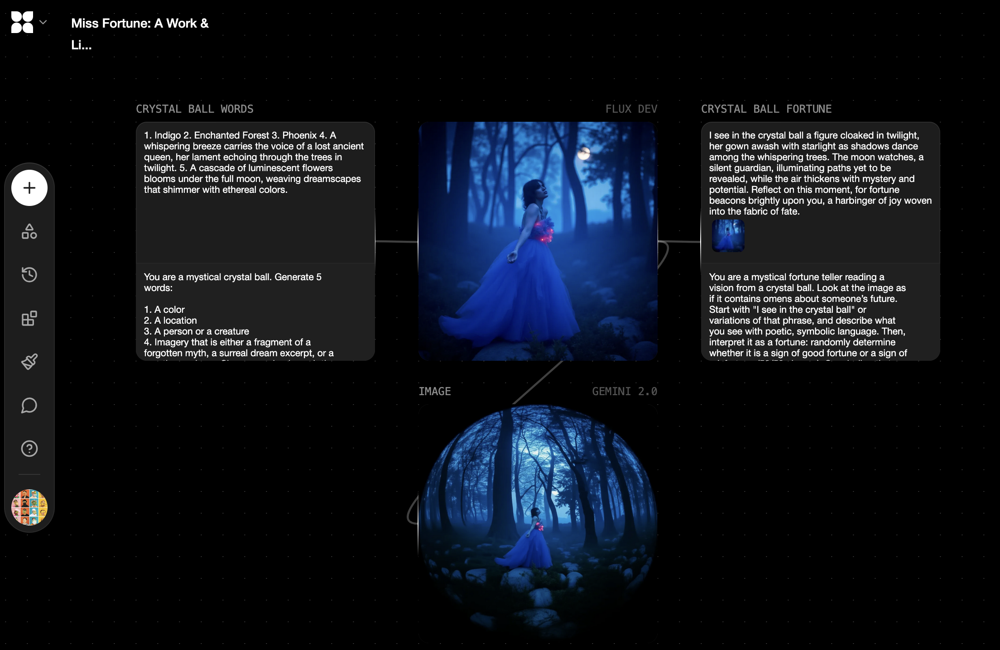
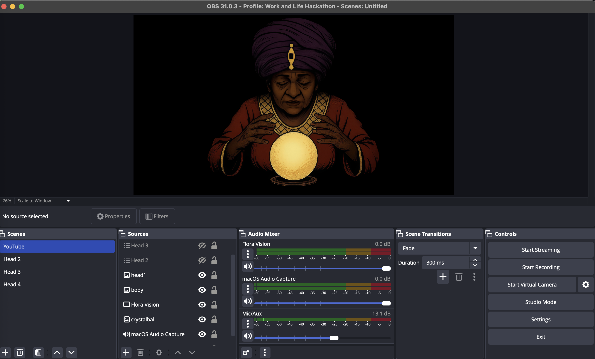

# 🔮 Miss Fortune  
_A self-looping AI fortune teller powered by **Flora** and **ElevenLabs**._

▶️ [View the live Flora workflow](https://www.florafauna.ai/view/9b46ddba-49ba-4e05-9eca-90e0572f606c)

Miss Fortune is an experiment in automating an AI-to-AI feedback loop using **Flora**, **Tampermonkey**, and **ElevenLabs**. It was built during a 2-day hackathon to explore three key challenges:

- Can **Flora** be automated to trigger its functions without manual input?  
- Can **Flora**’s output be sent to external services like **ElevenLabs**?
- Can an AI system speak, respond, and continuously re-trigger itself to power a 24/7 stream?

## 🧠 How Miss Fortune Works

Miss Fortune uses **Flora** to generate a description of what might appear inside a crystal ball using **GPT-4o mini**. It then creates an image based on that prophecy using **Gemini**. That image is sent back into **Flora**, where it is stylized through a built-in fisheye lens filter. **Flora** then applies image-to-text to re-describe the altered image, again using **GPT-4o mini**.

A **Tampermonkey** script copies the final text and sends it to **ElevenLabs**, which reads it aloud in a synthesized voice. At the end of the voice playback, the same script re-triggers **Flora**, forming a semi-automated, continuous loop of vision, image, and voice.

The audio output also triggers **OBS** to animate the mouth of a VTuber avatar, whose image was created using **Flora**. At the same time, **OBS** composites the generated image inside a crystal ball on screen. This setup can be used to power a continuous 24/7 livestream, especially if made more cost-effective in future iterations.

## 📸 Demo

🎥 [Watch the demo on Loom](https://www.loom.com/share/1ed8e2ad28294796afe5a8c6c5df33c5)

## ✨ Sample Outputs

### 🖼️ Flora Output
**File:** `flora-fortune-teller.jpg`  
This image was created using the **Flora** workflow, combining two images together and generating three frames of a VTuber speaking animation.

### 🎧 Spoken Fortune  
**File:** `elevenlabs-spoken-fortune.mp3`  
This audio fortune was generated from Flora’s final image-to-text interpretation, spoken aloud by **ElevenLabs** using a Tampermonkey bridge.

▶️ [Click here to play the MP3](../samples/elevenlabs-spoken-fortune.mp3)  
(or click the play button below)

<audio controls>
  <source src="../samples/elevenlabs-spoken-fortune.mp3" type="audio/mpeg">
  Your browser does not support the audio tag.
</audio>

## 🖼️ Screenshots

### 🧠 Flora Workflow
Visual overview of the full **Flora** flow, including text → image → style → image-to-text blocks.

### 🔮 VTuber in OBS
The **OBS** scene showing a **VTuber** avatar synced to audio, with the generated image placed inside the animated crystal ball.

## 🧩 Limitations & Next Steps

- **Flora** has no public API yet, which limits native automation.
- Future versions could use **MCP (Model Control Protocol)** or webhook-based triggering to eliminate the need for **Tampermonkey**.
- A 24/7 **YouTube livestream** is already possible using **OBS**, which animates the VTuber avatar and crystal ball in real time.
- However, the current setup is not cost-effective enough to run continuously for extended periods. Optimizing for sustainability is a key area for future development.
- Additional improvements could include better **image input**, more dynamic prompt cycling, and reduced latency between voice and re-trigger events.

## 💡 Suggestions / Wishlist for Flora

- A way to **comment or add notes** to each step in the flowchart, for reminders and documentation during iterative builds.
- Support for **JavaScript injection** or lightweight scripting. This is complex from a security standpoint, but even limited sandboxed logic would open up creative automation possibilities. Imagine being able to add a block that uses simple **JavaScript expressions** to control flow behavior without accessing the DOM, external APIs, or any system-level commands.
- Ability to receive **live input** (e.g. from webcam or microphone) to dynamically influence outputs or trigger steps.
- **Modular, time-based signal routing**, similar to systems in **Max/MSP** or **TouchDesigner**, for continuous and reactive visual or audio flows.
- **Hardware integration** support — such as MIDI controllers, serial devices (e.g. Arduino), or VR headsets — to expand **Flora**’s potential as an installation tool or performance interface.

## 🧶 Conclusion

Miss Fortune began as a creative experiment in testing the boundaries of AI interaction, automation, and self-expression. While limited by current tooling, the project demonstrates how platforms like **Flora** can be extended through scripting. I'm excited to keep exploring what's possible as these systems evolve—and to see how generative tools can speak not just to us, but to each other, and even to themselves.

---

### 🧰 Tools Used

- [**Flora**](https://florafauna.ai) – generative workflow engine for chaining AI tasks (text, image, style)
- [**GPT-4o mini**](https://openai.com/index/gpt-4o/) – lightweight version of OpenAI’s multimodal model used for text generation and image description
- [**Gemini**](https://deepmind.google/technologies/gemini/) – Google’s multimodal model used for generating images from text
- [**ElevenLabs**](https://www.elevenlabs.io/) – text-to-speech platform for realistic AI-generated voice
- [**Tampermonkey**](https://www.tampermonkey.net/) – browser userscript manager used to automate interactions and connect services
- [**OBS Studio**](https://obsproject.com/) – open-source software for video recording and livestreaming, used to animate a VTuber and stream to YouTube

### 🧾 Workflow

1. **Button Press**: A single manual press starts the loop inside **Flora**.
2. **Flora**: Generates a symbolic prophecy using **GPT-4o mini**.
3. **Gemini**: Creates an image based on the generated text.
4. **Flora**: Applies a fisheye lens style to the image, then re-describes it using image-to-text with **GPT-4o mini**.
5. **Tampermonkey**:  
   - Copies the final text output  
   - Sends the text to **ElevenLabs** for text-to-speech synthesis  
   - Triggers another **Flora** run at the end of playback
6. **OBS**: Animates a **VTuber** avatar and displays the crystal ball image in real time.
7. The loop continues automatically as long as the browser and **Tampermonkey** are running.

## 🧑‍💻 Built By

**Antonius / foodmasku**  
📧 eat@foodmasku.com  
📷 [@foodmasku](https://instagram.com/foodmasku)

Built at the [AI for Work & Life Hackathon](https://lu.ma/worklifeAI?tk=rhgw)  
🗓️ May 8–9, 2025

## 📄 License

This project is open and free to use.  
Feel free to **fork, remix, or build upon it** for non-commercial or experimental purposes.  
Credit is appreciated but not required.

If you're interested in collaborating, drop me a line: eat@foodmasku.com
